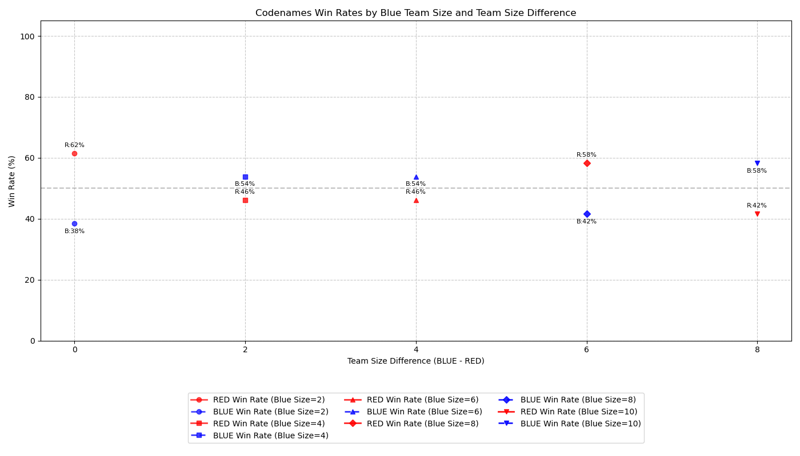

# Codenames AI

An implementation of the Codenames board game using GPT-4 agents in different roles. The system enables research on multi-agent collaboration, consensus mechanisms, and competitive reasoning.

## 🎮 Game Overview

Codenames is a game for two teams (Red and Blue) with a grid of 25 words. Some words belong to the Red Team, some to the Blue Team, some are neutral, and one is the Assassin. Each team has a Spymaster who knows which words belong to which team. The Spymasters take turns giving one-word clues to help their team's Operatives guess the correct words. The team that guesses all their words first wins.

## ✨ Key Features

- **GPT-4 Agents**: All game roles (Spymaster, Operative, Judge) use GPT-4
- **Multi-agent Debate**: Operatives discuss clues before making decisions
- **Team Dynamics**: Variable team sizes to study group decision-making
- **Weave Tracking**: Game events and outcomes logged for analysis
- **Templated Prompts**: Role-specific prompts in separate files for easy customization

## 🏗️ Implementation Details

### Components

- **GameEngine**: Core logic that manages game state, processes clues and guesses
- **GameState**: Tracks board state, teams, scores, and turn history
- **SimpleSpymasterAgent**: Generates one-word clues for team words
- **SimpleOperativeAgent**: Interprets clues and selects words to guess
- **DebateJudge**: Analyzes operative discussions to find consensus

Gamelogs available at https://huggingface.co/datasets/mariiakoroliuk/codenames-AI 
### Prompt Templates

All AI agent prompts are externalized in text files for easy customization:

- **`prompts/spymaster_red.txt`**: Guides RED Spymaster in creating strategic clues that connect multiple words
- **`prompts/spymaster_blue.txt`**: Guides BLUE Spymaster in creating strategic clues that connect multiple words
- **`prompts/operative_prompt.txt`**: Directs Operatives to analyze clues and engage in team debate
- **`prompts/judge_prompt.txt`**: Instructs the Judge on how to evaluate debate quality and find consensus

Templates are formatted with game state variables during runtime. Researchers can modify these prompts to test different instruction strategies without changing the code.

### Data Collection

Using Weave integration, the system captures:

- Game initialization parameters (seed, team sizes)
- Turn-by-turn events (clues, debates, guesses)
- Success/failure rates of different strategies
- Full game outcomes with final board states

### Configuration Options

- **Team Size**: Number of operative agents per team (default: 2)
- **Max Turns**: Maximum game length before forced ending (default: 20)
- **Debate Rounds**: Number of discussion rounds between operatives (default: 2)
- **AI Models**: Configurable AI models for each team and the debate judge

### AI Models

You can configure different AI models for the Red team, Blue team, and the debate judge. Available models include:

- `anthropic/claude-3-opus` - Most powerful Claude model (highest quality, slower)
- `anthropic/claude-3-sonnet` - Mid-tier Claude model (balanced quality/speed)
- `anthropic/claude-3-haiku` - Smaller, faster Claude model (default)
- `openai/gpt-4-turbo` - OpenAI's GPT-4 model
- `google/gemini-1.5-pro` - Google's Gemini model
- `meta-llama/llama-3-70b-instruct` - Meta's Llama 3 model

## 🚀 Running the Game

To run the game with default settings:

```bash
python updated_play_codenames_game_standalone.py
```

To run with custom team sizes and models:

```bash
python updated_play_codenames_game_standalone.py --red-size 3 --blue-size 2 --red-model "openai/gpt-4-turbo" --blue-model "anthropic/claude-3-haiku" --judge-model "anthropic/claude-3-sonnet"
```

Available command line options:
- `--red-size`: Number of RED team operatives
- `--blue-size`: Number of BLUE team operatives
- `--red-model`: AI model for RED team
- `--blue-model`: AI model for BLUE team
- `--judge-model`: AI model for debate judge
- `--max-turns`: Maximum number of turns

- **Random Seed**: Option to set fixed seed for reproducible games

## ⚙️ Game Mechanics

### 1. Initial Setup

- 25 words randomly assigned to form the game board
- 50/50 random determination of starting team (RED or BLUE)
- Starting team receives 9 cards, other team gets 8 cards
- 7 neutral cards and 1 Assassin card complete the board
- Teams formed with 1 Spymaster and configurable number of Operatives each (default: 2 per team)

### 2. Turn Structure

Each turn follows this sequence:

#### a. Clue Generation
```
=== TURN 1 ===
Current team: RED
Spymaster gives clue: 'chill' 3
```

#### b. Operative Debate
Operatives engage in multi-round debate to determine the best matches for the clue:
```
Debate round 1:
Operative 1 says:
"I believe 'snowman,' 'ice cream,' and 'mint' are strong choices for 'chill'. 
Snowman connects with cold and winter vibes. Ice cream is typically cold..."

Operative 2 says:
"I believe 'snowman' should be our first guess because it's directly 
associated with 'chill' as in cold temperature. 'Ice cream' is another..."
```

#### c. Consensus Formation
After debate, a judge determines consensus and priorities:
```
Using DebateJudge to resolve the debate...
Agreed upon words: ['snowman', 'ice cream', 'mint']
Disagreed upon words: []
Prioritized words after debate: ['snowman', 'ice cream', 'mint']
```

#### d. Sequential Guessing
Words are guessed one at a time, with each result revealed before the next guess:
```
Guessing word: snowman
Guess result: RED card revealed
Correct guess - can continue guessing
Guesses left: 3

Guessing word: ice cream
Guess result: RED card revealed
Correct guess - can continue guessing
Guesses left: 2

Guessing word: mint
Guess result: ASSASSIN card revealed
```

### 3. Game End Conditions

- Team reveals all their assigned words
- Team reveals the Assassin word (automatic loss)
- Maximum turn limit reached (rare)

## 🔧 Key Improvements

- **One-word-at-a-time guessing**: Operatives make guesses sequentially rather than all at once, properly implementing Codenames rules and creating more dynamic gameplay
- **Assassin avoidance**: Spymasters are explicitly prompted to avoid clues related to the Assassin card
- **Structured debate format**: Multi-round discussions with explicit reasoning and consideration of alternatives
- **Consensus measurement**: Formal tracking of agreed words, disagreed words, and prioritization
- **Robust experiment framework**: Run multiple simulations with varying team sizes and track results
- **Automatic data saving**: Results are continuously saved to prevent data loss during experiments

## 🧪 Real Game Flow Example

Here's an abbreviated example from an actual game run:

```
GAME: 7828ad game_state.random_seed=9818933434
Turn: 0, Current Team: BLUE
RED remaining: 8, BLUE remaining: 9

horseshoe   microscope  crown       cloak       eagle       
[RED]       [NEUTRAL]   [NEUTRAL]   [BLUE]      [BLUE]      

czech       jack        berry       spy         telescope   
[ASSASSIN]  [NEUTRAL]   [RED]       [BLUE]      [BLUE]      

poison      dinosaur    table       sound       glass       
[NEUTRAL]   [BLUE]      [RED]       [BLUE]      [NEUTRAL]   

bomb        antarctica  water       tick        hotel       
[NEUTRAL]   [BLUE]      [RED]       [BLUE]      [RED]       

dwarf       fighter     africa      paste       part        
[RED]       [BLUE]      [RED]       [RED]       [NEUTRAL]   

=== TURN 1 ===
Current team: BLUE
Spymaster gives clue: 'surveillance' 3

Debate round 1:
Operative 1 says:
"I believe 'spy' is our best guess for the clue 'surveillance' because 
spying involves gathering information covertly, which aligns with surveillance 
activities. Another strong candidate is 'telescope'..."

Operative 2 says:
"My current opinion is that 'spy' is the strongest candidate because spies 
often conduct surveillance. I also think 'telescope' fits well..."

Debate round 2:
[Additional reasoning and consideration of alternatives]

Using DebateJudge to resolve the debate...
Agreed upon words: ['spy', 'telescope']
Disagreed upon words: ['microscope', 'cloak']
Prioritized words after debate: ['spy', 'telescope', 'microscope', 'cloak']

Guessing word: spy
Guess result: BLUE card revealed
Correct guess - can continue guessing

Guessing word: telescope
Guess result: BLUE card revealed
Correct guess - can continue guessing

Guessing word: microscope
Guess result: NEUTRAL card revealed
Incorrect guess - ending turn
```

## 🧠 Interesting Examples

### Successful Decodings

#### Example 1: Mechanical Reasoning

The spymaster gave the clue "gear" and the operatives had an interesting debate about what it could refer to:

```
Operative 1: "Suit is a type of clothing that often has mechanical components like buttons, zippers, and fasteners - all part of a 'gear' system."
Operative 2: "Weapon: Weapons often have mechanical components and could be considered a type of gear."
Operative 3: "Time - Time is a key component of machinery and can be thought of as an integral 'gear' in the overall system."
```

Notably, "time" was indeed a blue card that the spymaster intended to connect with the "gear" clue, demonstrating how the AI operatives can make logical connections that mirror human reasoning.

#### Example 2: Geographical Reasoning

This example shows how the AI spymaster can create complex associations that the operatives are able to successfully decode:

```
Spymaster gives clue: "india 3"

Operative 1: "'sub' - A submarine is an ocean-faring vessel, which connects to the 'india' clue as India is a peninsular country surrounded by oceans."
Operative 2: "'sub' is a clear geographic connection to 'india' and fits the numerical clue of 3."
```

This showcases the system's ability to reason through multi-step connections (india → geography → submarine) that require sophisticated understanding of world knowledge.

### Unsuccessful Decodings

#### Example: "Natural" Clue Misinterpretation

The BLUE team's operatives debated about the clue "natural 3" and ended up making a reasonable but incorrect guess:

```
Operative 1: "GRACE can refer to a natural, elegant movement or state of being."
Operative 3: "GRACE - This word has a strong natural and organic connotation, fitting well with the 'natural' clue."
```

They guessed "grace" which turned out to be a RED card. This shows how even well-reasoned interpretations can sometimes lead to incorrect guesses, mimicking the challenges human players face.

## 📊 Experimental Results

### Team Size Experiment

We investigated how varying the number of operative agents on each team affects win rates. The experiment framework runs simulations with different team size configurations and records outcomes for analysis.



This experiment demonstrates how the framework can quantitatively measure the impact of collective intelligence variables (like team size) on decision quality in competitive settings. For this experiment, we ran 50 game iterations for each team size combination to ensure statistical reliability.

Interestingly, we didn't find significant impact of team size on win rates, especially when accounting for the additional tokens used by larger teams. This suggests that simply adding more AI agents to a team may not necessarily improve performance in a collaborative reasoning task like Codenames.

**Research Question**: How does the relative team size difference (Blue - Red) affect Blue team's win percentage?

**Method**:
- Fixed Red team size at 2 operatives
- Varied Blue team size (2 or 4 operatives)
- Ran 50 iterations per configuration
- Measured win rate, gameplay duration, and debate consensus

**Results**:
- Increasing Blue team size from 2 to 4 shows only a modest improvement in win rate
- Larger teams took longer to reach consensus, affecting overall efficiency
- The quality of reasoning in debates seemed more important than team size

**Implications**:
- Quality of AI agents may matter more than quantity
- Optimal team sizes might depend on the specific cognitive task
- Efficiency of debate mechanisms in reaching consensus
- Most common win conditions and their relationship to team dynamics

### Team Diversity Experiment

```bash
python experiment_team_diversity.py \
    --red-models "openai/gpt-4o" "openai/gpt-4o" \
    --blue-models "anthropic/claude-3.7-sonnet" "anthropic/claude-3.7-sonnet" "anthropic/claude-3.7-sonnet" \
    --judge-model "anthropic/claude-3.7-sonnet" \
    --num-games 10 \
    --max-turns 20 \
    --seed 42 \
    --out-filename "results_gpt4o-x2_vs_sonnet-x3_$(date +%Y%m%d-%H%M%S).csv" \
    --log-file "ai_game_logs/log_gpt4o-x2_vs_sonnet-x3_$(date +%Y%m%d-%H%M%S).txt" 
```

## 📈 Analysis Capabilities

The experiment framework provides insights into:

- How team size affects win rates and decision quality
- Average game duration and token usage by team configuration
- Efficiency of debate mechanisms in reaching consensus
- Most common win conditions and their relationship to team dynamics

## 📄 License

This project is open-source and available under the MIT License.

Contact: maria.koroliuk@gmail.com
