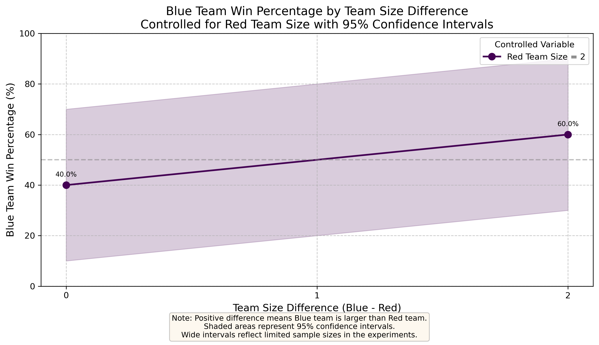

# Resilient Democracy Experiments: AI Collective Intelligence in Competitive Environments

A terminal-based implementation of the Codenames board game with AI players using language model APIs. This project explores how AI systems collectively reason, reach consensus, and coordinate under competitive pressure, with specific attention to debate structures and their effect on decision quality.

## 🎮 Game Overview

Codenames is a game for two teams (Red and Blue) with a grid of 25 words. Some words belong to the Red Team, some to the Blue Team, some are neutral, and one is the Assassin. Each team has a Spymaster who knows which words belong to which team. The Spymasters take turns giving one-word clues to help their team's Operatives guess the correct words. The team that guesses all their words first wins.

## ✨ Features

- **Full AI-powered gameplay**: Language models play as both Spymasters and Operatives
- **Multi-agent debate system**: AI Operatives engage in structured deliberation before guessing
- **Team-based collaboration**: Multiple AI agents must coordinate to succeed
- **Configurable team sizes**: Analyze how collective dynamics affect decision quality
- **Precise token tracking**: Measure resource consumption for research and optimization
- **Comprehensive experiment framework**: Run large-scale simulations with varying parameters
- **Byzantine fault tolerance testing**: (WIP) Test resilience against adversarial agents

## 🏗️ Game Architecture

The game is implemented with several key components:

- **GameEngine**: Core game logic that manages the game state, processing clues and guesses
- **GameState**: Represents the current state of the game (board, teams, scores, history)
- **SimpleSpymasterAgent**: AI agent that plays as a Spymaster, generating clues
- **SimpleOperativeAgent**: AI agent that plays as an Operative, guessing words based on clues
- **DebateJudge**: Analyzes debate transcripts to determine consensus and priorities
- **TokenUsageTracker**: Tracks API token usage for precise measurement

## ⚙️ Game Mechanics

### 1. Initial Setup

- Random assignment of 25 words to teams (typically 8-9 per team, 7-8 neutral, 1 Assassin)
- Teams (Red and Blue) are formed with 1 Spymaster and configurable number of Operatives each

### 2. Turn Structure

Each turn follows this sequence:

#### a. Clue Generation
```
=== TURN 1 ===
Current team: RED
Spymaster gives clue: 'chill' 3
```

#### b. Operative Debate
Operatives engage in multi-round debate to determine the best matches for the clue:
```
Debate round 1:
Operative 1 says:
"I believe 'snowman,' 'ice cream,' and 'mint' are strong choices for 'chill'. 
Snowman connects with cold and winter vibes. Ice cream is typically cold..."

Operative 2 says:
"I believe 'snowman' should be our first guess because it's directly 
associated with 'chill' as in cold temperature. 'Ice cream' is another..."
```

#### c. Consensus Formation
After debate, a judge determines consensus and priorities:
```
Using DebateJudge to resolve the debate...
Agreed upon words: ['snowman', 'ice cream', 'mint']
Disagreed upon words: []
Prioritized words after debate: ['snowman', 'ice cream', 'mint']
```

#### d. Sequential Guessing
Words are guessed one at a time, with each result revealed before the next guess:
```
Guessing word: snowman
Guess result: RED card revealed
Correct guess - can continue guessing
Guesses left: 3

Guessing word: ice cream
Guess result: RED card revealed
Correct guess - can continue guessing
Guesses left: 2

Guessing word: mint
Guess result: ASSASSIN card revealed
```

### 3. Game End Conditions

- Team reveals all their assigned words
- Team reveals the Assassin word (automatic loss)
- Maximum turn limit reached (rare)

## 🔧 Key Improvements

- **One-word-at-a-time guessing**: Operatives make guesses sequentially rather than all at once, properly implementing Codenames rules and creating more dynamic gameplay
- **Assassin avoidance**: Spymasters are explicitly prompted to avoid clues related to the Assassin card
- **Structured debate format**: Multi-round discussions with explicit reasoning and consideration of alternatives
- **Consensus measurement**: Formal tracking of agreed words, disagreed words, and prioritization
- **Robust experiment framework**: Run multiple simulations with varying team sizes and track results
- **Automatic data saving**: Results are continuously saved to prevent data loss during experiments

## 🧪 Real Game Flow Example

Here's an abbreviated example from an actual game run:

```
GAME: 7828ad game_state.random_seed=9818933434
Turn: 0, Current Team: BLUE
RED remaining: 8, BLUE remaining: 9

horseshoe   microscope  crown       cloak       eagle       
[RED]       [NEUTRAL]   [NEUTRAL]   [BLUE]      [BLUE]      

czech       jack        berry       spy         telescope   
[ASSASSIN]  [NEUTRAL]   [RED]       [BLUE]      [BLUE]      

poison      dinosaur    table       sound       glass       
[NEUTRAL]   [BLUE]      [RED]       [BLUE]      [NEUTRAL]   

bomb        antarctica  water       tick        hotel       
[NEUTRAL]   [BLUE]      [RED]       [BLUE]      [RED]       

dwarf       fighter     africa      paste       part        
[RED]       [BLUE]      [RED]       [RED]       [NEUTRAL]   

=== TURN 1 ===
Current team: BLUE
Spymaster gives clue: 'surveillance' 3

Debate round 1:
Operative 1 says:
"I believe 'spy' is our best guess for the clue 'surveillance' because 
spying involves gathering information covertly, which aligns with surveillance 
activities. Another strong candidate is 'telescope'..."

Operative 2 says:
"My current opinion is that 'spy' is the strongest candidate because spies 
often conduct surveillance. I also think 'telescope' fits well..."

Debate round 2:
[Additional reasoning and consideration of alternatives]

Using DebateJudge to resolve the debate...
Agreed upon words: ['spy', 'telescope']
Disagreed upon words: ['microscope', 'cloak']
Prioritized words after debate: ['spy', 'telescope', 'microscope', 'cloak']

Guessing word: spy
Guess result: BLUE card revealed
Correct guess - can continue guessing

Guessing word: telescope
Guess result: BLUE card revealed
Correct guess - can continue guessing

Guessing word: microscope
Guess result: NEUTRAL card revealed
Incorrect guess - ending turn
```
## 🚀 Getting Started

### Prerequisites

- Python 3.6+
- OpenAI API key (or alternative language model API key)

### Installation

1. Clone this repository:
   ```bash
   git clone https://github.com/your-username/codenames-ai.git
   cd codenames-ai
   ```

2. Install the required dependencies:
   ```bash
   pip install -r requirements.txt
   ```

3. Set your API key:
   ```bash
   export OPENAI_API_KEY="your-api-key-here"
   ```

### Running the Game

#### Single Game

To run a single game with default settings (2 operatives per team):
```bash
python updated_play_codenames_game_standalone.py
```

The default implementation doesn't support command-line arguments for team sizes, but you can modify the team sizes by editing the variables at the bottom of the script:

```python
# Define team sizes
red_team_size = 2
blue_team_size = 3
```

#### Running Experiments

To run team size experiments with the experiment framework:

```python
# From experiment_team_size.py
experiment = run_experiment(
    red_team_min=2,
    red_team_max=8,
    red_team_step=2,
    blue_team_min=2,
    blue_team_max=8,
    blue_team_step=2,
    iterations=3  # Number of games per configuration
)
```

To execute the experiment script:

```bash
python experiment_team_size.py
```

#### Example Experiment: How Team Size Impact on Win Rates

We investigated how varying the number of operative agents on each team affects win rates. The experiment framework runs simulations with different team size configurations and records outcomes for analysis.

**Research Question**: How does the relative team size difference (Blue - Red) affect Blue team's win percentage?

**Method**:
- Fixed Red team size at 2 operatives
- Varied Blue team size (2 or 4 operatives)
- Ran multiple game iterations per configuration
- Tracked win rates and calculated 95% confidence intervals

**Results**:




This experiment demonstrates how the framework can quantitatively measure the impact of collective intelligence variables (like team size) on decision quality in competitive settings.

## 📈 Analysis Capabilities

The experiment framework provides insights into:

- How team size affects win rates and decision quality
- Average game duration and token usage by team configuration
- Efficiency of debate mechanisms in reaching consensus
- Most common win conditions and their relationship to team dynamics


## 📄 License

This project is open-source and available under the MIT License.

Contact: maria.koroliuk@gmail.com
